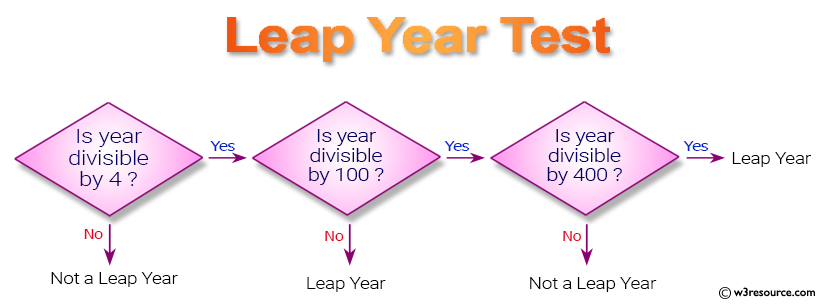

1) Write a Java program to get a number from the user and print whether it is positive or negative.<!-- 1 -->

2) Write a Java program that takes a number from the user and generates an integer between 1 and 7. It displays the weekday name.-Done

3) Write a Java program to find the number of days in a month.-Done

4) Write a Java program that requires the user to enter a single character from the alphabet. Print Vowel or Consonant, depending on user input. If the user input is not a letter (between a and z or A and Z), or is a string of length > 1, print an error message.

5) Write a Java program that takes a year from the user and prints whether it is a leap year or not.

(year % 4) == 0;
(year % 100) != 0;
((year % 100 == 0) && (year % 400 == 0));

6) Write a Java program to display the first 10 natural numbers.-Done

7) sum of natural numbers-Done

8) Write a program in Java to input 5 numbers from the keyboard and find their sum and average.-Done

9) Write a Java program to display the cube of the given number up to an integer.-Done

10) Write a Java program to display the multiplication table of a given integer.-Done

11) Write a Java program that displays the sum of n odd natural numbers.-Done

12) Write a Java program to display the pattern like a right angle triangle with a number.
1                                                                                
12                                                                               
123                                                                              
1234                                                                             
12345                                                                            
123456                                                                           
1234567                                                                          
12345678                                                                         
123456789                                                                        
12345678910

13)  Write a program in Java to make such a pattern like a right angle triangle with a number which repeats a number in a row.
1
22
333
4444

14) Write a Java program to make such a pattern like a right angle triangle with the number increased by 1.
1
2 3
4 5 6
7 8 9 10 

15) Write a Java program to make such a pattern like a pyramid with a number that repeats in the same row.
       1
      2 2
     3 3 3
    4 4 4 4 
  
16) 
    1 1
    1 2
    1 3
    2 1
    2 2
    2 3
    3 1
    3 2
    3 3

17) 
    3 5   
    6 10  
    9 15  
    12 20 
    15 25 
    18 30 
    21 35 
    24 40 
    27 45 
    30 50 
